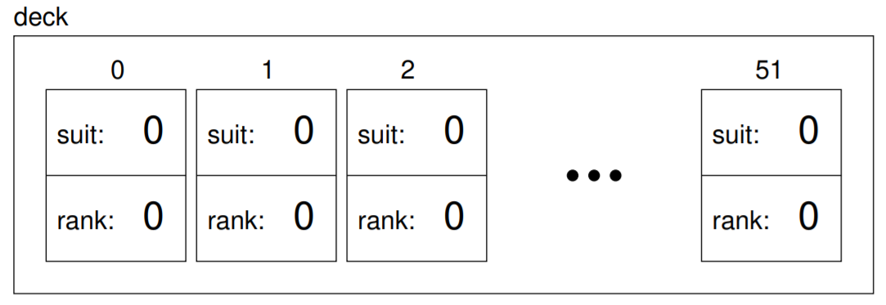

Vectors of cards
----------------

The reason I chose ``Cards`` as the objects for this chapter is that
there is an obvious use for a vector of cards—a deck. Here is some code
that creates a new deck of 52 cards:

::

     std::vector<playing_card> deck (52);

Here is the state diagram for this object:

The three dots represent the 48 cards I didn’t feel like drawing. Keep
In mind that we haven’t initialized the instance variables of the cards
yet. In some environments, they will get initialized to zero, as shown
In the figure, but in others they could contain any possible value.

One way to initialize them would be to pass a ``playing_card`` as a second
argument to the constructor:

::

     playing_card ace_of_spades (3, 1);
     std::vector<playing_card> deck (52, ace_of_spades);

This code builds a deck with 52 identical cards, like a special deck for
a magic trick. Of course, it makes more sense to build a deck with 52
different cards in it. To do that we use a nested loop.

The outer loop enumerates the suits, from 0 to 3. For each suit, the
inner loop enumerates the ranks, from 1 to 13. Since the outer loop
iterates 4 times, and the inner loop iterates 13 times, the total number
of times the body is executed is 52 (13 times 4).

::

     std::size_t i = 0;
     for (int suit = 0; suit <= 3; suit++) {
       for (int rank = 1; rank <= 13; rank++) {
         deck[i].suit = suit;
         deck[i].rank = rank;
         i++;
       }
     }

I used the variable ``i`` to keep track of where in the deck the next
card should go.

Notice that we can compose the syntax for selecting an element from an
array (the ``[]`` operator) with the syntax for selecting an instance
variable from an object (the dot operator). The expression
``deck[i].suit`` means “the suit of the ith card in the deck”.

This deck-building code is encapsulated in a function called
``build_deck`` that takes no parameters and that returns a
fully-populated vector of ``playing_card``\ s.

Take a look at the active code below, which includes the implementation of
the ``build_deck`` function.

.. tb-code:: cpp
   :name: c192_12_6-support
   :hidden:
   :compileargs: ['-Wall', '-Wextra', '-std=c++20']

   playing_card::playing_card () {
      suit = 0;  rank = 1;
   }

   playing_card::playing_card (int s, int r) {
      suit = s;  rank = r;
   }

   void playing_card::print () const {
      std::vector<std::string> suits (4);
      suits[0] = "Clubs";
      suits[1] = "Diamonds";
      suits[2] = "Hearts";
      suits[3] = "Spades";

      std::vector<std::string> ranks (14);
      ranks[1] = "Ace";
      ranks[2] = "2";
      ranks[3] = "3";
      ranks[4] = "4";
      ranks[5] = "5";
      ranks[6] = "6";
      ranks[7] = "7";
      ranks[8] = "8";
      ranks[9] = "9";
      ranks[10] = "10";
      ranks[11] = "Jack";
      ranks[12] = "Queen";
      ranks[13] = "King";

      std::cout << ranks[rank] << " of " << suits[suit] << '\n';
   }

.. tb-code:: cpp
   :name: c192_12_6
   :caption: Example c192_12_6
   :run-after: c192_12_6-support
   :compileargs: ['-Wall', '-Wextra', '-std=c++20']

   #include <cstddef>
   #include <iostream>
   #include <string>
   #include <vector>

   struct playing_card {
       int suit, rank;

       playing_card ();
       playing_card (int s, int r);
       void print () const;
   };

   std::vector<playing_card> build_deck() {
       std::vector<playing_card> deck (52);
       std::size_t i = 0;
       for (int suit = 0; suit <= 3; suit++) {
           for (int rank = 1; rank <= 13; rank++) {
               deck[i].suit = suit;
               deck[i].rank = rank;
               i++;
           }
       }
       return deck;
   }

   int main() {
       std::vector<playing_card> deck = build_deck();
       std::cout << "We just created our deck of 52 cards. We can access an individual card by indexing." << '\n';
       std::cout << "For example, the first card in the deck is: ";
       deck[0].print();
   }

.. tb-choice::
   :name: vector_of_cards_1

   Take a look at the code below. What can we say about the deck that is created?
   ::

     vector<card> create_deck() {
        vector<card> deck (16);
        int i = 0;
        for (int suit = 0; suit <= 1; suit++) {
           for (int rank = 4; rank <= 11; rank++) {
              deck[i].suit = suit;
              deck[i].rank = rank;
              i++;
           }
        }
        return deck;
     }

   - [x] There are 16 cards in the deck.

     Correct! You can verify this by checking how many times the for loops execute.
   - [ ] The deck is single-suited.

     Incorrect! Look at the conditions of the outer for loop, you'll find that there are two suits in this deck.
   - [ ] There are no face cards in the deck.

     Incorrect! Look at the conditions of the inner for loop, you'll find that this deck contains face cards.
   - [x] The deck does not contain any Hearts.

     Correct! The two suits in this deck are Clubs and Diamonds.
   - [x] There are two Jacks in the deck.

     Correct! The deck contains the Jack of Clubs and the Jack of Diamonds.

.. tb-blank::
   :name: c192_vector_of_cards_2

   If we actually created the deck in the previous question, what is printed after the following code runs?

   ::

    deck[11].print();

   Type your answer exactly as it would appear in the terminal!

   {{blank}}

   .. tb-answer::
      :match: 7 of diamonds
      :feedback: Correct!
      :incorrect: Incorrect, try modifying the activecode and writing a print statement!

