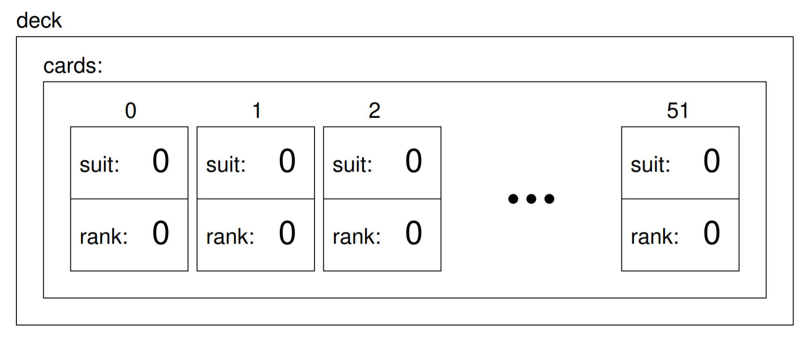

.. _objects-vectors-decks:

Decks
-----

In the previous chapter, we worked with a vector of objects, but I also
mentioned that it is possible to have an object that contains a vector
as an instance variable. In this chapter I am going to create a new
object, called a ``card_deck``, that contains a vector of ``playing_card``\ s.

The structure definition looks like this

::

   struct card_deck {
     std::vector<playing_card> cards;

     card_deck (std::size_t n);
   };

   card_deck::card_deck (std::size_t size) {
     std::vector<playing_card> temp (size);
     cards = temp;
   }

The name of the instance variable is ``cards`` to help distinguish the
``card_deck`` object from the vector of ``playing_card``\ s that it contains.

For now there is only one constructor. It creates a local variable named
``temp``, which it initializes by invoking the constructor for the
``vector`` class, passing the size as a parameter. Then it copies the
vector from ``temp`` into the instance variable ``cards``.

Now we can create a deck of cards like this:

::

     card_deck deck (52);

Here is a state diagram showing what a ``card_deck`` object looks like:

   Deck object state diagram

The object named ``deck`` has a single instance variable named
``cards``, which is a vector of ``playing_card`` objects. To access the cards in
a deck we have to compose the syntax for accessing an instance variable
and the syntax for selecting an element from an array. For example, the
expression ``deck.cards[i]`` is the ith card in the deck, and
``deck.cards[i].suit`` is its suit. The following loop

::

     for (std::size_t i = 0; i<52; i++) {
       deck.cards[i].print();
     }

demonstrates how to traverse the deck and output each card.

.. tb-blank::
   :name: c192_decks_1

   A euchre deck consists of 9's, 10's, Jacks, Queens, Kings, and Aces.
   If we wanted to create a deck that is the size of the euchre deck, we
   would type: ``card_deck euchre_deck`` {{blank}} ``;``

   .. tb-answer::
      :match: (24)
      :feedback: Correct!
      :incorrect: Try again!

.. tb-choice::
   :name: decks_2

   Take a look at the state diagram in :numref:`fig_deck_stack`. When we create a deck of cards using ``deck deck (52)``, 
   what is true about our new deck?

   - [ ] The ranks and suits of the cards are initialized to the proper ranks and suits in a standard deck of cards.

     Unless you the programmer tell it to, the computer won't do it.
   - [x] There will be 52 cards.

     We initialized cards with a value of 52.
   - [x] The ranks and suits will be initialized to their default values.

     In our case is, the default values are zero.
   - [x] The only instance variable in the deck is cards.

     cards is a vector of Cards!
   - [ ] You can't access individual cards in the deck.

     You can access any card by indexing, for example: deck.cards[n].

.. tb-choice::
   :name: decks_3

   ``ACE`` corresponds to a rank of value ``0``. 

   - [ ] True - because this is the default mapping of enumerated types.

     The default mapping begins with 0.
   - [ ] True - because our definition of rank overrides the default mapping.

     Our definition doesn't use the default mapping, which begins with 0.
   - [ ] False - because this is the default mapping of enumerated types.

     The default mapping begins with 0.
   - [x] False - because our definition of rank overrides the default mapping.

     If we wanted to, we could have set the rank of ace to 7, and the rest of the cards would still be ranked in order.

