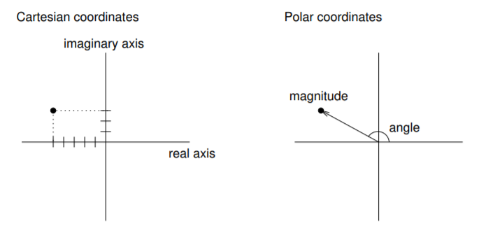

complex_number numbers
----------------------

As a running example for the rest of this chapter we will consider a
class definition for complex numbers. complex_number numbers are useful for
many branches of mathematics and engineering, and many computations are
performed using complex arithmetic. A complex number is the sum of a
real part and an imaginary part, and is usually written in the form
:math:`x + yi`, where :math:`x` is the real part, :math:`y` is the
imaginary part, and :math:`i` represents the square root of -1.

The following is a class definition for a user-defined type called
``complex_number``:

::

   class complex_number
   {
     double real = 0.0, imag = 0.0;

   public:
     complex_number () = default;
     complex_number (double r, double i) { real = r;  imag = i; }
   };

Because this is a ``class`` definition, the instance variables ``real``
and ``imag`` are private, and we have to include the label ``public:``
to allow client code to invoke the constructors.

As usual, there are two constructors: one takes no parameters and does
nothing; the other takes two parameters and uses them to initialize the
instance variables.

So far there is no real advantage to making the instance variables
private. Let’s make things a little more complicated; then the point
might be clearer.

There is another common representation for complex numbers that is
sometimes called “polar form” because it is based on polar coordinates.
Instead of specifying the real part and the imaginary part of a point in
the complex plane, polar coordinates specify the direction (or angle) of
the point relative to the origin, and the distance (or magnitude) of the
point.

The following figure shows the two coordinate systems graphically.

complex_number numbers in polar coordinates are written :math:`r e^{i \theta}`,
where :math:`r` is the magnitude (radius), and :math:`\theta` is the
angle in radians.

.. note::
   Fortunately, it is easy to convert from one form to another. To go from
   Cartesian to polar,

   .. math::

     \begin{aligned}
     r       & = &  \sqrt{x^2 + y^2} \\
     \theta  & = &  \operatorname{atan2}(y, x)\end{aligned}

   To go from polar to Cartesian,

   .. math::

     \begin{aligned}
     x       & = &  r \cos \theta \\
     y       & = &  r \sin \theta\end{aligned}

So which representation should we use? Well, the whole reason there are
multiple representations is that some operations are easier to perform
In Cartesian coordinates (like addition), and others are easier in polar
coordinates (like multiplication). One option is that we can write a
class definition that uses *both* representations, and that converts
between them automatically, as needed.

::

   class complex_number
   {
     double real = 0.0, imag = 0.0;
     double mag = 0.0, theta = 0.0;
     bool cartesian, polar;

   public:
     complex_number () { cartesian = true;  polar = false; }

     complex_number (double r, double i)
     {
       real = r;  imag = i;
       cartesian = true;  polar = false;
     }
   };

There are now six instance variables, which means that this
representation will take up more space than either of the others, but we
will see that it is very versatile.

Four of the instance variables are self-explanatory. They contain the
real part, the imaginary part, the angle and the magnitude of the
complex number. The other two variables, ``cartesian`` and ``polar`` are
flags that indicate whether the corresponding values are currently
valid.

The default constructor creates the complex number zero. Its Cartesian
representation is valid immediately. The polar flag is false because we
have not yet calculated that representation.

The second constructor uses the parameters to initialize the real and
imaginary parts, but it does not calculate the magnitude or angle.
Setting the ``polar`` flag to false warns other functions not to access
``mag`` or ``theta`` until they have been set.

Now it should be clearer why we need to keep the instance variables
private. Unrestricted access would let client code change one representation
without updating the other. Accessor functions can calculate a representation
before returning its values. The class still has to initialize its members
and maintain the flags correctly; private access alone does not guarantee this.

Take a look at the active code below, which demonstrates the separation of
interface and implementation using classes. In this code, we create a ``triangle``
object which is represented by three sides. in ``main``, we print out the perimeter of
the triangle, which should be 12.

.. tb-code:: cpp
   :name: c192_fourteentwo
   :caption: Example c192_fourteentwo
   :compileargs: ['-Wall', '-Wextra', '-std=c++20']

   #include <iostream>

   class triangle {
     private:
       double side_a, side_b, side_c;
     public:
       triangle () {side_a = 1; side_b = 1; side_c = 1;}
       triangle (double a_in, double b_in, double c_in) {
         side_a = a_in;
         side_b = b_in;
         side_c = c_in;
       }
       double perimeter () {
         return side_a + side_b + side_c;
       }
   };

   int main() {
     triangle t1(3, 4, 5);
     std::cout << t1.perimeter();
   }

Now take a look at this second piece of active code. What if we decide we want
to represent a ``triangle`` in a different way? Because the way we represent a
``triangle`` is private, we can easily change the implementation while keeping
the interface the same. Now, ``triangle`` is represented by two sides and the
angle between them. Notice how our ``main`` function is the exact same as before.

.. tb-code:: cpp
   :name: c192_fourteenthree
   :caption: Example c192_fourteenthree
   :compileargs: ['-Wall', '-Wextra', '-std=c++20']

   #include <iostream>
   #include <cmath>

   class triangle {
     private:
       double side_a, side_b, angle;
     public:
       triangle () {side_a = 1; side_b = 1; angle = std::acos(-1.0) / 3.0;}
       triangle (double a_in, double b_in, double c_in) {
         side_a = a_in;
         side_b = b_in;
         // Law of Cosines: c^2 = a^2 + b^2 - 2abcosC
         angle = std::acos((std::pow(a_in, 2) + std::pow(b_in, 2) - std::pow(c_in, 2))
                      / (2 * a_in * b_in));
       }
       double perimeter () {
         return side_a + side_b +
                std::sqrt(std::pow(side_a, 2) + std::pow(side_b, 2)
                - 2 * side_a * side_b * std::cos(angle));
       }
   };

   int main() {
     triangle t1(3, 4, 5);
     std::cout << t1.perimeter();
   }

.. tb-parsons::
   :name: c192_question14_3_1

   Let's write a constructor that uses parameters to
   initialize the magnitude and theta, but does not calculate
   the real and imaginary parts. Set the cartesian flag to false.

   .. code-block:: c++

      {{group}}
      complex_number (double m, double t)
      {{endgroup}}
      {{distractor}}
      {{group}}
      complex_number (int m, int t)
      {{endgroup}}
      {{group}}
      {
      {{endgroup}}
      {{group}}
        mag = m;   theta = t;
      {{endgroup}}
      {{group}}
        cartesian = false;   polar = true;
      {{endgroup}}
      {{distractor}}
      {{group}}
        cartesian = true;   polar = false;
      {{endgroup}}
      {{group}}
      }
      {{endgroup}}

.. tb-choice::
   :name: c192_question14_3_2

   - [x] True

     Correct! Client programs wouldn't have access to these values in the first place.
   - [ ] False

     Incorrect! Keeping instance variables private prevents client programs from accessing them.

